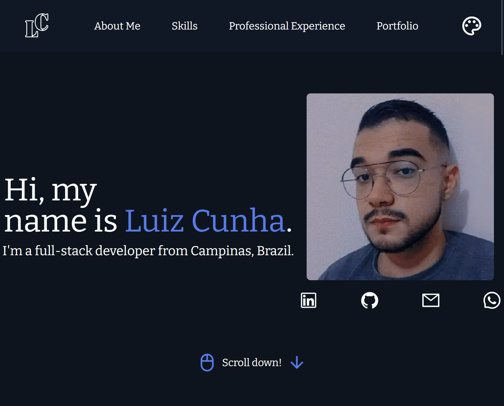

# 🚀 Luiz Cunha - Portfolio

<div align="center">


**Personal portfolio website showcasing my skills, experience, and projects as a Full Stack Developer.**

[🌐 Live Demo](https://luizcunha.dev) • [💼 LinkedIn](https://www.linkedin.com/in/luizmcunha/) • [📧 Contact](mailto:luizcunha.dev99@gmail.com)

</div>

---

## 📸 Preview

<div align="center">
  
</div>

---

## ✨ Features

- 🎨 **Modern & Responsive Design** - Beautiful UI that works on all devices
- 🌓 **Dark/Light Theme** - Toggle between themes using next-themes
- 🎬 **Smooth Animations** - Powered by Framer Motion for fluid transitions
- 📱 **Mobile-First** - Optimized for mobile devices
- ⚡ **Fast Performance** - Built with Next.js for optimal loading speeds
- 🔍 **SEO Optimized** - Meta tags and semantic HTML for better discoverability

---

## 🛠️ Tech Stack

### Frontend
| Technology | Description |
|------------|-------------|
| [Next.js 14](https://nextjs.org/) | React framework for production |
| [React 18](https://react.dev/) | UI library |
| [TypeScript](https://www.typescriptlang.org/) | Type-safe JavaScript |
| [TailwindCSS](https://tailwindcss.com/) | Utility-first CSS framework |
| [Framer Motion](https://www.framer.com/motion/) | Animation library |

### UI Components & Styling
| Technology | Description |
|------------|-------------|
| [MUI (Material-UI)](https://mui.com/) | React component library |
| [React Icons](https://react-icons.github.io/react-icons/) | Icon library |
| [next-themes](https://github.com/pacocoursey/next-themes) | Theme management |

### Tools & Infrastructure
| Technology | Description |
|------------|-------------|
| [ESLint](https://eslint.org/) | Code linting |
| [Sharp](https://sharp.pixelplumbing.com/) | Image optimization |
| [Vercel](https://vercel.com/) | Deployment platform |

---

## 📁 Project Structure

```
portfolio/
├── public/                    # Static files
│   └── CV- Luiz Miguel da Cunha.pdf
├── src/
│   ├── app/                   # Next.js App Router
│   │   ├── favicon.ico
│   │   ├── globals.css
│   │   ├── layout.tsx
│   │   ├── not-found.tsx
│   │   └── page.tsx
│   ├── assets/                # Images and icons
│   │   ├── me.jpg
│   │   └── skills/           # 41 skill icons (SVG)
│   └── components/            # React components
│       ├── aboutMe.tsx        # About section
│       ├── footer.tsx         # Footer component
│       ├── header.tsx         # Navigation header
│       ├── introduction.tsx   # Hero section
│       ├── portfolio.tsx      # Projects showcase
│       ├── professionalExperience.tsx  # Timeline
│       └── skills.tsx         # Skills carousel
├── tailwind.config.ts
├── tsconfig.json
└── package.json
```

---

## 🚀 Getting Started

### Prerequisites

- Node.js 18+ 
- npm, yarn, pnpm, or bun

### Installation

1. **Clone the repository**
   ```bash
   git clone https://github.com/Luiz-Cunha-Dev/portfolio.git
   cd portfolio
   ```

2. **Install dependencies**
   ```bash
   npm install
   # or
   yarn install
   # or
   pnpm install
   ```

3. **Run the development server**
   ```bash
   npm run dev
   # or
   yarn dev
   # or
   pnpm dev
   ```

4. **Open your browser**
   
   Navigate to [http://localhost:3000](http://localhost:3000)

---

## 📜 Available Scripts

| Command | Description |
|---------|-------------|
| `npm run dev` | Start development server |
| `npm run build` | Build for production |
| `npm run start` | Start production server |
| `npm run lint` | Run ESLint |

---

## 🎨 Sections

### 1. **Introduction**
Hero section with personal introduction, profile picture, and social links.

### 2. **About Me**
Personal background, education summary, and downloadable resume.

### 3. **Skills**
Animated carousel showcasing 40+ technologies including:
- **Languages:** JavaScript, TypeScript, Python
- **Frontend:** React, Next.js, HTML5, CSS3, Sass, TailwindCSS
- **Backend:** Node.js, Express
- **Databases:** PostgreSQL, MySQL, MongoDB, Redis
- **Tools:** Docker, Git, Jest, Prisma, and more

### 4. **Professional Experience**
Interactive timeline with toggle between:
- 📚 **Education** - Academic background
- 💼 **Experience** - Professional career

### 5. **Portfolio**
Showcase of personal and professional projects.

### 6. **Footer**
Contact information and social media links.

---

## 🌐 Deployment

This project is optimized for deployment on [Vercel](https://vercel.com/):

[](https://vercel.com/new/clone?repository-url=https://github.com/Luiz-Cunha-Dev/portfolio)

Or deploy manually:

```bash
npm run build
npm run start
```

---

## 📄 License

This project is open source and available under the [MIT License](LICENSE).

---

## 👤 Author

**Luiz Miguel da Cunha**

- 🌐 Website: [luizcunha.dev](https://luizcunha.dev)
- 💼 LinkedIn: [@luizmcunha](https://www.linkedin.com/in/luizmcunha/)
- 🐙 GitHub: [@Luiz-Cunha-Dev](https://github.com/Luiz-Cunha-Dev)
- 📧 Email: luizcunha.dev99@gmail.com

---

<div align="center">

**⭐ If you like this project, please give it a star!**

Made with ❤️ by Luiz Cunha

</div>
